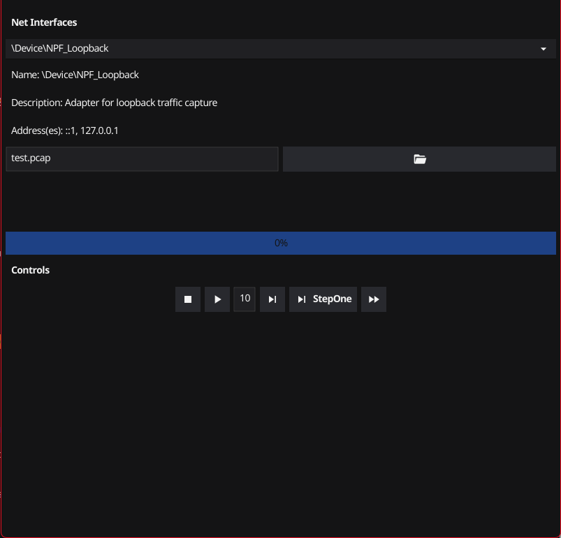

# Repcap
[](https://choosealicense.com/licenses/mit/)  

A tcpreplay like tool with GUI for pcap files and media controls.
Built with [Go](https://go.dev/) and [Fyne](https://github.com/fyne-io/fyne).

It can be used as a CLI tool but also supports usage through it's GUI.

> [!WARNING]
> Repcap is still in its very early stages of development, hence it hasn't been released yet.
> Only way to get it as of now is to build it yourself.

## Why?

I needed a tool since I was working on another project that required me to replay wireshark recordings (pcap files) all the time. Although a Python script managed to accomplish the task, achieving precise control is sometimes challenging, particularly when one wishes to repeat distinct segments of the file at various times. After looking through GitHub for comparable tools, I discovered a few outdated tools, which inspired me to create my own.

## Screenshots

Screenshot of it in it's current state (Work In Progress)


## Features
*TBD*

<!--
- Light/dark mode toggle
- Cross platform
-->

## Installation

You can install Repcap using Go:
```bash
go install github.com/lemorz56/repcap@latest
```

Using [scoop](https://scoop.sh):
```bash
scoop install my-project
```

or from the [GitHub releases section]()

then run it with to see instructions.
```bash
repcap -h
```

### Usage
*TBD*

---

## Contributing

Contributions are always welcome!

You'll need to install [pre-commit]() and follow [Conventional Commits]().
<!-- pre-commit install && pre-commit install --hook-type commit-msg -->
See `CONTRIBUTING.md` for ways to get started.
- Clone the repository
- Checkout branch named `feat/feature-name` or `bug/bug-name`
- Commit
- Create PR
- Wait for approval!

## Acknowledgements

 - [Fyne](https://github.com/fyne-io/fyne)
 - [PcapReplay - other](https://www.google.com) <!-- todo: link -->

## Authors

- [@lemorz56](https://www.github.com/lemorz56)
